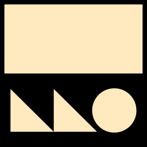

<picture>
  <source media="(prefers-color-scheme: dark)" srcset="./.github/assets/logo.svg">
  
</picture>

### `LeveGL`

[![License][license-badge]][license-link]

A simple rendering library for a simpler world. 🍃

<div flex="true">
  <a href="#">
    Documentation
  </a>
</div>

## Introduction

`LeveGL` aims to empower you to build and prototype games quickly. It is a lightweight rendering library written in C99, drawing inspiration from the simplicity of [Raylib](https://github.com/raysan5/raylib) and the robustness of [liblava](https://github.com/liblava/liblava). Originally a study project, the focus is on keeping the code clear, simple, and easy to work with.

> _It started as a learning project, but I’ve come to appreciate its simple and practical design, which makes it great for experimenting._

<details open>
<summary>
 Screenshots
</summary> <br />

<p align="center">
    
&nbsp;
    
</p>

  <p align="center">
    
&nbsp;

</details>

## Usage

> [!CAUTION]
> `LeveGL` is currently in a highly work-in-progress state. The API is unstable and subject to significant changes. It is intended for learning and experimentation purposes.

To get started with, here's a simple example that demonstrates the basics:

This ~~minimal~~ code creates a window and draws a static triangle in the center. The triangle is drawn using simple trigonometric calculations to position its vertices equidistant from the center point.

```c
#include "levegl/levegl.h"

int main( void )
{
    // Set up window
    const int width = 480;
    const int height = 272;

    InitWindow( width, height, "LeveGL Triangle" );
    SetTargetFPS( 60 );

    // Calculate fixed triangle points
    float cx = width / 2.0F;
    float cy = height / 2.0F;
    float r = 100.0F;

    // Points for an upward-facing triangle
    float x1 = cx;                        // Top point
    float y1 = cy - r;
    float x2 = cx - r * 0.866F;           // Bottom left (cos(120°))
    float y2 = cy + r * 0.5F;             // Bottom left (sin(120°))
    float x3 = cx + r * 0.866F;           // Bottom right (cos(240°))
    float y3 = cy + r * 0.5F;             // Bottom right (sin(240°))

    // Main loop
    while( !ShouldQuit() )
    {
	// Draw triangle
	BeginDrawing();
        {
		ClearBackground( WHITE );
		DrawTriangle( (int)x1, (int)y1, (int)x2, (int)y2, (int)x3, (int)y3, BLACK );
	}
        EndDrawing();
    }

    // Close window and clean up resources before exiting
    CloseWindow();

    return 0;
}
```

## Build & Run

##### CPM.cmake

1. First, set up [CPM.cmake] in your project:

   ```bash
   mkdir -p cmake
   wget -O cmake/CPM.cmake https://github.com/cpm-cmake/CPM.cmake/releases/latest/download/get_cpm.cmake
   ```

2. In your `CMakeLists.txt`, add the following lines after `project(...)`:

   ```cmake
   include(cmake/CPM.cmake)

   CPMAddPackage("gh:SOHNE/LeveGL@0.0.1")

   add_executable(your_target main.cpp)
   target_link_libraries(your_target PRIVATE LeveGL::LeveGL)

## Roadmap

- [ ] Design and implement an OpenGL Abstraction Layer
- [ ] Font rendering system
- [ ] 3D shapes and models
- [ ] Dedicated documentation page

## Contributing

The majority of LeveGL code is open-source. We are committed to a transparent development process and highly appreciate any contributions. Whether you are helping us fix bugs, proposing new features, improving our documentation or spreading the word - we would love to have you as a part of the SOHNE/LeveGL community. Please refer to our [contribution guidelines](./CONTRIBUTING.md).

- Bug Report: If you see an error message or encounter an issue while using LeveGL, please create a [bug report](https://github.com/SOHNE/LeveGL/issues/new?assignees=&labels=type%3A+bug&template=bug.yaml&title=%F0%9F%90%9B+Bug+Report%3A+).

- Feature Request: If you have an idea or if there is a capability that is missing and would make development easier and more robust, please submit a [feature request](https://github.com/SOHNE/LeveGL/issues/new?assignees=&labels=type%3A+feature+request&template=feature.yml).

- Documentation Request: If you're reading the LeveGL docs and feel like you're missing something, please submit a [documentation request](https://github.com/SOHNE/LeveGL/issues/new?assignees=&labels=type%3A+docs&template=documentation-request.yaml&title=%F0%9F%93%96+Documentation%3A+).

## License

**LeveGL** is licensed under the [zlib/libpng license](https://opensource.org/licenses/zlib).

You are free to use, modify, and distribute this library under the following conditions:

1.  **No Misrepresentation:** You must not misrepresent the origin of the software. If you use this software in a product, an acknowledgment in the product documentation is appreciated but not required.
2.  **Modified Versions:** Altered source versions must be clearly marked as such and must not be misrepresented as the original software.
3.  **License Notice:** This license notice may not be removed or altered from any source distribution.

For the full license text, please see the [LICENSE](./LICENSE) file.

LeveGL depends on several third-party libraries and dependencies, each distributed under its own license. It is the responsibility of the user to review and comply with these additional licenses.

---

[//]: (Externals)

[license-badge]: https://img.shields.io/github/license/SOHNE/LeveGL
[license-link]: https://github.com/SOHNE/LeveGL/blob/main/LICENSE

[CPM.cmake]: https://github.com/cpm-cmake/CPM.cmake/
[CMake]: https://cmake.org/

[//]: (EOF)

